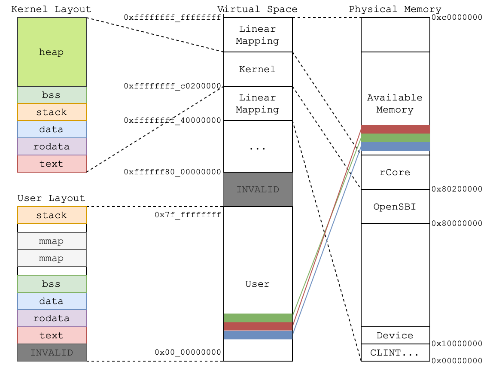
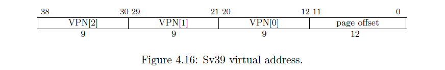
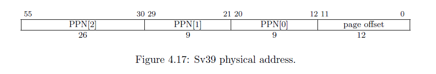
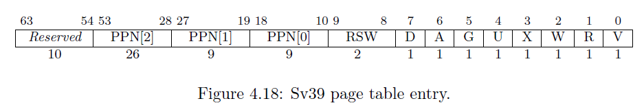

# Lab 3学习报告

## 虚拟地址（VA）和物理地址（PA）

引用百度百科中的说法：

> 虚拟内存是计算机系统内存管理的一种技术。它使得应用程序认为它拥有连续的可用的内存（一个连续完整的地址空间），而实际上，它通常是被分隔成多个物理内存碎片，还有部分暂时存储在外部磁盘存储器上，在需要时进行数据交换。目前，大多数操作系统都使用了虚拟内存，如Windows家族的“虚拟内存”；Linux的“交换空间”等。

简单来说，虚拟内存就是一种内存映射机制。它可以让每一个被执行的程序，都“认为“自己获得了一段独立的地址空间。同时，也便于内核检查内存访问越界。

> 这个执行上看到的地址空间，就是虚拟内存。而访问虚拟内存的地址就是**虚拟地址（Virtual Address）**，与之对应的是**物理地址（Physical Address）**。这样的设计会导致上层的应用程序可能会访问同一个值相等的虚拟地址，所以操作系统需要做的就是替这些程序维护这个虚拟地址到物理地址的映射。甚者，为了统一和连贯，内核自己本身访问内存也将会通过虚拟地址。
>
> 我们可以说这个映射的**维护**是操作系统在做，但是大量频繁的访存不可能全部通过调用操作系统的接口来获取真实的物理地址。所以，这里硬件也会参与，帮我们快速**查询**操作系统维护的映射，而这个机制就是页表。

也就是说，在我们的系统中，我们所需要做的事就是去**维护页表**。而当程序访问虚拟地址的时候，硬件会自动的根据页表，将虚拟地址转换为物理地址并访问。

下面一张图解释了非教学版 rCore 的内存映射关系。



## Sv39

页表的设计和接口会有很多种，这里我们选择 RISC-V 本身硬件支持的 Sv39 模式作为页表的实现。

### 虚拟地址（VA, Virtual Address）

Sv39 模式支持 39 位虚拟地址的分页机制，每一页的大小为 `4KB` 。

在 Sv39 模式中，虚拟地址虽然由 64 位组成，但只有低 39 位有效，剩余的高位必须和第 38 位相同（之后都以 0 开始索引），否则会产生 `Page Fault`。

在虚拟地址的有效的 39 位中，低 12 位被称作页偏移（Page Offset），页偏移在对应的虚拟地址和物理地址中都相同，用于记录地址在一个页面中的偏移量。

在虚拟地址的有效的 39 位中，高 27 位被称为虚拟页号（Virtual Page Number），而且为了支持多级页号索引，VPN 往往被分为多个部分。在 Sv39 中，27 位的 VPN 被分成 3 个部分。

虚拟地址格式的示意图如下：



### 物理地址（PA, Physics Address）

在经过页表的映射后，虚拟地址中的 VPN 会被映射成物理页号（PPN）。物理页号共 44 位，同样分成三个部分。物理地址中的页面偏移与其虚拟地址中的页面偏移相同。

值得注意的是，物理地址中的高 12 位不参与寻址过程，被用作往后拓展使用。

物理地址格式的示意图如下：



### 页表项（PTE, Page Table Entry）

一个**页表项（PTE，Page Table Entry）**是用来描述一个虚拟页号如何映射到物理页号的。如果一个虚拟页号通过某种手段找到了一个页表项，并通过读取上面的物理页号完成映射，我们称这个虚拟页号通过该页表项完成映射的。

我们可以看到 Sv39 模式里面的一个页表项大小为 64 位（即 8 字节）。其中第 53-10 共 44 位为一个物理页号，表示这个虚拟页号映射到的物理页号。后面的第 9-0 位则描述页的相关状态信息。

- `V` 表示这个页表项是否合法。如果为 0 表示不合法，此时页表项其他位的值都会被忽略。

- `R,W,X` 分别表示是否可读（Readable）、可写（Writable）和可执行（Executable）。

  - 以 `W` 这一位为例，如果为零表示不可写，那么如果一条 `store` 的指令，它通过这个页表项完成了虚拟页号到物理页号的映射，找到了物理地址。但是仍然会报出异常，是因为这个页表项规定如果物理地址是通过它映射得到的，执行的行为和页表描述的状态并不一致。
  - 同时，根据 `R,W,X` 取值的不同，我们还有一些特别表示和约定：

  

  - 也就是说，如果 `R,W,X` 均为 0，文档上说这表示这个页表项指向下一级页表，我们先暂时记住就好。

- `U` 为 1 表示用户态运行的程序可以通过该页表项完成地址映射。事实上用户态运行的程序也只能够通过 `U` 为 1 的页表项进行虚实地址映射。
  
  - 然而，我们所处在的 S 态也并不是理所当然的可以访问通过这些 `U` 为 1 的页表项进行映射的用户态内存空间。我们需要将 S 态的状态寄存器 `sstatus` 上的 `SUM (permit Supervisor User Memory access)` 位手动设置为 1 才可以做到这一点。否则 S 态通过的 `load/store` 等指令在访问`U` 为 1 的页表项映射的用合同内存空间时，CPU 会报出异常。
- `A` 表示 Accessed，如果为 1 则表示自从上次 `A` 被清零后，有虚拟地址通过这个页表项进行读写。
- `D` 表示 Dirty，如果为 1 表示自从上次 `D` 被清零后，有虚拟地址通过这个页表项进行写入。
- `G` 表示 Global，意味着该页表项和其子项都为全局映射，可在所有的地址域中访问。
- `RSW` 两位留给 S 态的程序来进行拓展功能实现。

### 多级页表

在 Sv39 模式中我们采用三级页表，即将 27 位的虚拟页号分为三个等长的部分，第 26-18 位为三级索引 $\text{VPN}_2$，第 17-9 位为二级索引 $\text{VPN}_1$，第 8-0 位为一级索引 $\text{VPN}_0$。

我们也将页表分为三级页表，二级页表，一级页表。每个页表都用 9 位索引的，因此有 $2^{9}=512$ 个页表项，而每个页表项都是 8 字节，因此每个页表大小都为 $512\times 8=4\text{KB}$。正好是一个物理页的大小。我们可以把一个页表放到一个物理页中，并用一个物理页号来描述它。事实上，三级页表的每个页表项中的物理页号可描述一个二级页表；二级页表的每个页表项中的物理页号可描述一个一级页表；一级页表中的页表项内容则和我们刚才提到的页表项一样，其内容包含物理页号，即描述一个要映射到的物理页。

具体来说，假设我们有虚拟地址 $(\text{VPN}_2, \text{VPN}_1, \text{VPN}_0, \text{offset})$：

- 我们首先会记录装载「当前所用的三级页表的物理页」的页号到 `satp` 寄存器中；
- 把 $\text{VPN}_2$ 作为偏移在三级页表的物理页中找到第二级页表的物理页号；
- 把 $\text{VPN}_1$ 作为偏移在二级页表的物理页中找到第一级页表的物理页号；
- 把 $\text{VPN}_0$ 作为偏移在一级页表的物理页中找到要访问位置的物理页号；
- 物理页号对应的物理页基址加上 $\text{offset}$ 就是虚拟地址对应的物理地址。

通过这种复杂的手段，终于从虚拟页号找到了一级页表项，从而得出了物理页号。刚才我们提到若页表项满足 `R,W,X` 都为 0，表明这个页表项指向下一级页表。在这里三级和二级页表项的 `R,W,X` 为 0 应该成立，因为它们指向了下一级页表。

然而三级和二级页表项不一定要指向下一级页表。我们知道每个一级页表项控制一个虚拟页号，即控制 4KB 虚拟内存；每个二级页表项则控制 9 位虚拟页号，总计控制 $4\text{KB}\times 2^9=2\text{MB}$ 虚拟内存；每个三级页表项控制 18 位虚拟页号，总计控制 $2\text{MB}\times 2^9=1\text{GB}$ 虚拟内存。我们可以将二级页表项的 `R,W,X` 设置为不是全 0 的，那么它将与一级页表项类似，只不过可以映射一个 2MB 的**大页（Huge Page）**。同理，也可以将三级页表项看作一个叶子，来映射一个 1GB 的大页。这样在 RISC-V 中，可以很方便地建立起大页机制。

### 页表基址寄存器

页表的基址（起始地址）一般会保存在一个特殊的寄存器中。在 RISC-V 中，这个特殊的寄存器就是页表寄存器 satp。下图的 WARL 表示 Write Any Values, Reads Legal Values。


我们使用寄存器 `satp` 来控制 CPU 进行页表映射。

- `MODE` 控制 CPU 使用哪种页表实现，我们只需将 `MODE` 设置为 8 即表示 CPU 使用 Sv39 。
- `ASID` 表示地址空间标识符，这里还没有涉及到进程的概念，我们不需要管这个地方。
- `PPN` 存的是三级页表所在的物理页号。这样，给定一个虚拟页号，CPU 就可以从三级页表开始一步步的将其映射到一个物理页号。

于是，OS 可以在内存中为不同的应用分别建立不同虚实映射的页表，并通过修改寄存器 `satp` 的值指向不同的页表，从而可以修改 CPU 虚实地址映射关系及内存保护的行为。

### 快表（TLB）

我们知道，物理内存的访问速度要比 CPU 的运行速度慢很多。如果我们按照页表机制循规蹈矩的一步步走，将一个虚拟地址转化为物理地址需要访问 3 次物理内存，得到物理地址后还需要再访问一次物理内存，才能完成访存。这无疑很大程度上降低了效率。

事实上，实践表明虚拟地址的访问具有时间局部性和空间局部性。因此，在 CPU 内部，我们使用**快表（TLB, Translation Lookaside Buffer）**来作为虚拟页号到物理页号的映射的缓存。这部分知识在计算机组成原理课程中有所体现，当我们要做一个映射时，会有很大可能这个映射在近期被完成过，所以我们可以先到 TLB 里面去查一下，如果有的话我们就可以直接完成映射，而不用访问那么多次内存了。

但如果修改了 `satp` 寄存器，说明 OS 切换到了一个与先前映射方式完全不同的页表。此时快表里面存储的映射已经失效了，这种情况下 OS 要在修改 `satp` 的指令后面马上使用 `sfence.vma` 指令刷新整个 TLB。

同样，我们手动修改一个页表项之后，也修改了映射，但 TLB 并不会自动刷新，我们也需要使用 `sfence.vma` 指令刷新 TLB。如果不加参数的，`sfence.vma` 会刷新整个 TLB。你可以在后面加上一个虚拟地址，这样 `sfence.vma` 只会刷新这个虚拟地址的映射。

## 修改内核

### 修改链接器脚本

我们现在想将内核代码放在虚拟地址空间中以 0xffffffff80200000 开头的一段高地址空间中。这意味着原来放在 0x80200000 起始地址的全部内核结构被平移到了 0xffffffff80200000 的地址上，即映射关系为：虚拟地址减去偏移量 0xffffffff00000000 为原来的物理地址。当然，这种线性平移并不是唯一的映射方式，但是至少现在，内核的全部代码和数据所在的虚拟空间和物理空间是这样的线性映射。

所以需要把原来的 linker script 和之前在物理内存管理上的一些参数修改一下。

```
/* Linker Script 语法可以参见：http://www.scoberlin.de/content/media/http/informatik/gcc_docs/ld_3.html */

/* 目标架构 */
OUTPUT_ARCH(riscv)

/* 执行入口 */
ENTRY(_start)

/* 数据存放起始地址 */
BASE_ADDRESS = 0xffffffff80200000; /* 修改为虚拟地址 */

SECTIONS
{
    /* . 表示当前地址（location counter） */
    . = BASE_ADDRESS;

    /* start 符号表示全部的开始位置 */
    kernel_start = .;

    /* 加入对齐 */
    . = ALIGN(4K);
    text_start = .;

    /* .text 字段 */
    .text : {
        /* 把 entry 函数放在最前面 */
        *(.text.entry)
        /* 要链接的文件的 .text 字段集中放在这里 */
        *(.text .text.*)
    }

    /* 加入对齐 */
    . = ALIGN(4K);
    rodata_start = .;

    /* .rodata 字段 */
    .rodata : {
        /* 要链接的文件的 .rodata 字段集中放在这里 */
        *(.rodata .rodata.*)
    }

    /* 加入对齐 */
    . = ALIGN(4K);
    data_start = .;

    /* .data 字段 */
    .data : {
        /* 要链接的文件的 .data 字段集中放在这里 */
        *(.data .data.*)
    }

    /* 加入对齐 */
    . = ALIGN(4K);
    bss_start = .;

    /* .bss 字段 */
    .bss : {
        /* 要链接的文件的 .bss 字段集中放在这里 */
        *(.sbss .bss .bss.*)
    }

    /* 结束地址 */
    /* 加入对齐 */
    . = ALIGN(4K);
    kernel_end = .;
}
```

> 首先，对于 linker script，我们把放置的基地址修改为了虚拟地址，另外还有一些修改是我们把每个数据段都对齐到了 4KB，一个 4KB 的虚拟页中不会包含两个段，这意味着这个页的属性是可以确定的。举个例子，如果不对齐的话，只读的 .rodata 和 .data 段可能放在一个页中，但是页表中需要写上诸如是否可写的属性，这时候就必须分开才可以标注属性。

可以发现，此时的 `linker.ld` 中除了起始地址改为了 0xffffffff80200000 之外，还多了许多 `ALIGN(4K)` 的对齐语句。这就是为了避免在同一个 4KB 页面中，存在两个不同访问权限的段。

对应修改 `os/src/memory/config.rs` 中的 `KERNEL_END_ADDRESS` 修改为虚拟地址并加入偏移量：

```rust
lazy_static! {
    /// 内核代码结束的地址，即可以用来分配的内存起始地址
    /// 
    /// 因为 Rust 语言限制，我们只能将其作为一个运行时求值的 static 变量，而不能作为 const
    pub static ref KERNEL_END_ADDRESS: VirtualAddress = VirtualAddress(kernel_end as usize); 
}

/// 内核使用线性映射的偏移量
pub const KERNEL_MAP_OFFSET: usize = 0xffff_ffff_0000_0000;
```

和上一章类似，我们也对虚拟地址和虚拟页号这两个类进行了封装，同时也支持了一些诸如 `VirtualAddress::from(PhysicalAddress)` 的转换 trait（即一些加减偏移量等操作），这部分实现更偏向于 Rust 语法，这里不再赘述实现方法，想去了解实现时可以参考 `os/src/memory/address.rs`。

### 初始的映射

最后一步，我们需要告诉 RISC-V CPU 我们做了这些修改，也就是需要在启动时、在进入 `rust_main` 之前我们要完成一个从物理地址访存模式到虚拟访存模式的转换，同时这也意味着，我们要写一个简单的页表，完成这个线性映射：

```assembly
# 操作系统启动时所需的指令以及字段
#
# 我们在 linker.ld 中将程序入口设置为了 _start，因此在这里我们将填充这个标签
# 它将会执行一些必要操作，然后跳转至我们用 rust 编写的入口函数
#
# 关于 RISC-V 下的汇编语言，可以参考 https://github.com/riscv/riscv-asm-manual/blob/master/riscv-asm.md
# %hi 表示取 [12,32) 位，%lo 表示取 [0,12) 位

    .section .text.entry
    .globl _start
# 目前 _start 的功能：将预留的栈空间写入 $sp，然后跳转至 rust_main
_start:
	# 注释 1
    # 计算 boot_page_table 的物理页号
    lui t0, %hi(boot_page_table)
    li t1, 0xffffffff00000000
    sub t0, t0, t1
    srli t0, t0, 12
    # 注释 2
    # 8 << 60 是 satp 中使用 Sv39 模式的记号
    li t1, (8 << 60)
    or t0, t0, t1
    # 注释 3
    # 写入 satp 并更新 TLB
    csrw satp, t0
    sfence.vma

    # 加载栈地址
    lui sp, %hi(boot_stack_top)
    addi sp, sp, %lo(boot_stack_top)
    # 跳转至 rust_main
    lui t0, %hi(rust_main)
    addi t0, t0, %lo(rust_main)
    jr t0

    # 回忆：bss 段是 ELF 文件中只记录长度，而全部初始化为 0 的一段内存空间
    # 这里声明字段 .bss.stack 作为操作系统启动时的栈
    .section .bss.stack
    .global boot_stack
boot_stack:
    # 16K 启动栈大小
    .space 4096 * 16
    .global boot_stack_top
boot_stack_top:
    # 栈结尾

    # 初始内核映射所用的页表
    .section .data
    .align 12
boot_page_table:
    .quad 0
    .quad 0
    # 注释 4
    # 第 2 项：0x8000_0000 -> 0x8000_0000，0xcf 表示 VRWXAD 均为 1
    .quad (0x80000 << 10) | 0xcf
    .zero 507 * 8
    # 注释 5
    # 第 510 项：0xffff_ffff_8000_0000 -> 0x8000_0000，0xcf 表示 VRWXAD 均为 1
    .quad (0x80000 << 10) | 0xcf
    .quad 0
```

注释 1 处，我们将 `boot_page_table` 的实际物理地址计算出来，即将其虚拟地址减去偏移量，就得到他在内核加载时的实际物理地址。再得到其页号（地址右移 12 位），存入 `t0`。

注释 2 处，设置页表模式为 Sv39。

注释 3 处，更新 `satp` 寄存器，并刷新页表信息。

注释 4 处，表示将从 `0x8000_0000` 开始的 1GB 的虚拟地址，映射到同样的物理地址中。因为 `0x8000_0000` 对应的 $\text{VPN}_2$ 为 2 ，即对应着第三级页表的第 2 项。可见，这是一个大页。之所以要这一段的原因如下：

> 因为，在跳转到 `rust_main` 之前（即 `jr t0`）之前，PC 的值都还是 0x802xxxxx 这样的地址，即使是写入了 `satp` 寄存器，但是 PC 的地址不会变。为了执行这段中间的尴尬的代码，我们在页表里面也需要加入这段代码的地址的映射。

注释 5 处，表示将从 `0xffff_ffff_8000_0000` 开始的 1GB 的虚拟地址，通过线性映射，映射到 `0x8000_0000` 的段中。

## 实现页表

### 完善VirtualAddress

为了实现 Sv39 页表，我们的思路是把一个分配好的物理页（即会自动销毁的 `FrameTracker`）拿来把数据填充作为页表，而页表中的每一项是一个 8 字节的页表项。一个 `4KB` 的物理页，正好可以当作一个页表。

然后我们实现一个获取各级页号的函数：

```rust
impl VirtualPageNumber {
    /// 得到一、二、三级页号
    pub fn levels(self) -> [usize; 3] {
        [
            self.0.get_bits(18..27),
            self.0.get_bits(9..18),
            self.0.get_bits(0..9),
        ]
    }
}
```

这个方法一次性返回三个页号 $\text{VPN}_1,\text{VPN}_2,\text{VPN}_3$。

### 页表项

在这里，我们封装一个页表项的结构体。因为一个页表项为 `8KB` ，因此我们用 `usize` 类型即可。位于 `os/src/memory/mapping/page_table_entry.rs`。

```rust
/// Sv39 结构的页表项
#[derive(Copy, Clone, Default)]
pub struct PageTableEntry(usize);

impl PageTableEntry {
    /// 将相应页号和标志写入一个页表项
    pub fn new(page_number: PhysicalPageNumber, flags: Flags) -> Self {
        Self(
            *0usize
                .set_bits(..8, flags.bits() as usize)
                .set_bits(10..54, page_number.into()),
        )
    }
    /// 获取页号
    pub fn page_number(&self) -> PhysicalPageNumber {
        PhysicalPageNumber::from(self.0.get_bits(10..54))
    }
    /// 获取地址
    pub fn address(&self) -> PhysicalAddress {
        PhysicalAddress::from(self.page_number())
    }
    /// 获取标志位
    pub fn flags(&self) -> Flags {
        unsafe { Flags::from_bits_unchecked(self.0.get_bits(..8) as u8) }
    }
    /// 是否为空（可能非空也非 Valid）
    pub fn is_empty(&self) -> bool {
        self.0 == 0
    }
}

impl core::fmt::Debug for PageTableEntry {
    fn fmt(&self, formatter: &mut core::fmt::Formatter) -> core::fmt::Result {
        formatter
            .debug_struct("PageTableEntry")
            .field("value", &self.0)
            .field("page_number", &self.page_number())
            .field("flags", &self.flags())
            .finish()
    }
}

bitflags! {
    /// 页表项中的 8 个标志位
    #[derive(Default)]
    pub struct Flags: u8 {
        /// 有效位
        const VALID =       1 << 0;
        /// 可读位
        const READABLE =    1 << 1;
        /// 可写位
        const WRITABLE =    1 << 2;
        /// 可执行位
        const EXECUTABLE =  1 << 3;
        /// 用户位
        const USER =        1 << 4;
        /// 全局位，我们不会使用
        const GLOBAL =      1 << 5;
        /// 已使用位，用于替换算法
        const ACCESSED =    1 << 6;
        /// 已修改位，用于替换算法
        const DIRTY =       1 << 7;
    }
}
```

### 页表

有了页表项，512 个连续的页表项组成的 4KB 物理页，同时再加上一些诸如多级添加映射的功能，就可以封装为页表。位于 `os/src/memory/mapping/page_table.rs`。

```rust
/// 存有 512 个页表项的页表
///
/// 注意我们不会使用常规的 Rust 语法来创建 `PageTable`。相反，我们会分配一个物理页，
/// 其对应了一段物理内存，然后直接把其当做页表进行读写。我们会在操作系统中用一个「指针」
/// [`PageTableTracker`] 来记录这个页表。
#[repr(C)]
pub struct PageTable {
    pub entries: [PageTableEntry; PAGE_SIZE / 8],
}

impl PageTable {
    /// 将页表清零
    pub fn zero_init(&mut self) {
        self.entries = [Default::default(); PAGE_SIZE / 8];
    }
}
```

然而，我们不会把这个巨大的数组在函数之间不停传递，我们这里的思路也同样更多利用 Rust 的特性，所以做法是利用一个 `PageTableTracker` 的结构对 `FrameTracker` 封装，但是里面的行为是对 `FrameTracker` 记录的物理页当成 `PageTable` 进行操作。同时，这个 `PageTableTracker` 和 `PageTableEntry` 也通过一些 Rust 中的自动解引用的特性为后面的实现铺平了道路，比如我们可以直接把 `PageTableTracker` 当成 `PageTable` 对待，同时，如果一个 `PageTableEntry` 指向的是另一个 `PageTable` 我们可以直接方便的让编译器自动完成这些工作。

```rust
/// 类似于 [`FrameTracker`]，用于记录某一个内存中页表
///
/// 注意到，「真正的页表」会放在我们分配出来的物理页当中，而不应放在操作系统的运行栈或堆中。
/// 而 `PageTableTracker` 会保存在某个线程的元数据中（也就是在操作系统的堆上），指向其真正的页表。
///
/// 当 `PageTableTracker` 被 drop 时，会自动 drop `FrameTracker`，进而释放帧。
pub struct PageTableTracker(pub FrameTracker);

impl PageTableTracker {
    /// 将一个分配的帧清零，形成空的页表
    pub fn new(frame: FrameTracker) -> Self {
        let mut page_table = Self(frame);
        page_table.zero_init();
        page_table
    }
    /// 获取物理页号
    pub fn page_number(&self) -> PhysicalPageNumber {
        self.0.page_number()
    }
}
```

## 内核重映射

在上文中，我们虽然构造了一个简单映射使得内核能够运行在虚拟空间上，但是这个映射是比较粗糙的。

我们知道一个程序通常含有下面几段：

- `.text` 段：存放代码，需要可读、可执行的，但不可写；
- `.rodata` 段：存放只读数据，顾名思义，需要可读，但不可写亦不可执行；
- `.data` 段：存放经过初始化的数据，需要可读、可写；
- `.bss` 段：存放零初始化的数据，需要可读、可写。

我们看到各个段之间的访问权限是不同的。在现在的映射下，我们甚至可以修改内核 `.text` 段的代码。因为我们通过一个标志位 `W` 为 1 的页表项完成映射。

因此，我们考虑对这些段分别进行重映射，使得他们的访问权限被正确设置。

这个需求可以抽象为一段内存（可能是很多个虚拟页）通过一个方式映射到很多个物理页上，同时这个内存段将会有一个统一的属性和进一步高层次的管理。

举个例子，在内核的代码段中 `.bss` 段可能不止会占用一个页面，而是很多页面，我们需要把全部的这些页面以线性的形式映射到一个位置。同时整个这些页面构成的内存段将会有统一的属性交由内核来管理。

### 内存段映射

正如上面说的，内存段是一篇连续的虚拟页范围，其中的每一页通过线性映射（直接偏移到一个物理页）或者分配（其中的每个虚拟页调用物理页分配器分配一个物理页）。线性映射出现在内核空间中；而为了支持每个用户进程看到的虚拟空间是一样的，我们不能全都用线性映射，所以基于页分配的方式会出现在用户这种情景下。如果你还是不明白，可以去翻看一下本章的「虚拟地址到物理地址」一个小节中非教学版 rCore 的映射图。

下面，我们用 `enum` 和 `struct` 来封装内存段映射的类型和内存段本身。位于 `os/src/memory/mapping/segment.rs`。

```rust
/// 映射的类型
#[derive(Debug)]
pub enum MapType {
    /// 线性映射，操作系统使用
    Linear,
    /// 按帧分配映射
    Framed,
}

/// 一个映射片段（对应旧 tutorial 的 `MemoryArea`）
#[derive(Debug)]
pub struct Segment {
    /// 映射类型
    pub map_type: MapType,
    /// 所映射的虚拟地址
    pub page_range: Range<VirtualPageNumber>,
    /// 权限标志
    pub flags: Flags,
}
```

后面，上层需要做的是把一个 Segment 中没有建立物理页映射关系的全部虚拟页，都申请到物理页并建立映射关系（或者说线性映射没有这样的虚拟页，而分配映射需要把每个虚拟页都申请一个对应的物理页）。

于是我们可以实现这样一个需要具体分配的迭代器：

```rust
impl Segment {
    /// 遍历对应的物理地址（如果可能）
    pub fn iter_mapped(&self) -> Option<impl Iterator<Item = PhysicalPageNumber>> {
        match self.map_type {
            // 线性映射可以直接将虚拟地址转换
            MapType::Linear => Some(self.iter().map(PhysicalPageNumber::from)),
            // 按帧映射无法直接获得物理地址，需要分配
            MapType::Framed => None,
        }
    }
}
```

### Mapping

有了页表、内存段，我们对这两个进行组合和封装，借助其中对页表的操作实现对内存段的映射，或者也可以说这里的结构是对上一小节的页表的进一步的从单级到三级的封装，需要记录根页表和对其中申请的页表进行追踪来控制何时释放空间。

位于 `os/src/memory/mapping/mapping.rs`。

```rust
#[derive(Default)]
/// 某个线程的内存映射关系
pub struct Mapping {
    /// 保存所有使用到的页表
    page_tables: Vec<PageTableTracker>,
    /// 根页表的物理页号
    root_ppn: PhysicalPageNumber,
}

impl Mapping {
    /// 创建一个有根节点的映射
    pub fn new() -> MemoryResult<Mapping> {
        let root_table = PageTableTracker::new(FRAME_ALLOCATOR.lock().alloc()?);
        let root_ppn = root_table.page_number();
        Ok(Mapping {
            page_tables: vec![root_table],
            root_ppn,
        })
    }
}
```

后面，实现对页表的查找，并利用该函数实现对虚拟页号到物理页号的映射：

```rust
/// 找到给定虚拟页号的三级页表项
///
/// 如果找不到对应的页表项，则会相应创建页表
pub fn find_entry(&mut self, vpn: VirtualPageNumber) -> MemoryResult<&mut PageTableEntry> {
    // 从根页表开始向下查询
    // 这里不用 self.page_tables[0] 避免后面产生 borrow-check 冲突（我太菜了）
    let root_table: &mut PageTable = PhysicalAddress::from(self.root_ppn).deref_kernel();
    let mut entry = &mut root_table.entries[vpn.levels()[0]];
    // println!("[{}] = {:x?}", vpn.levels()[0], entry);
    for vpn_slice in &vpn.levels()[1..] {
        if entry.is_empty() {
            // 如果页表不存在，则需要分配一个新的页表
            let new_table = PageTableTracker::new(FRAME_ALLOCATOR.lock().alloc()?);
            let new_ppn = new_table.page_number();
            // 将新页表的页号写入当前的页表项
            *entry = PageTableEntry::new(new_ppn, Flags::VALID);
            // 保存页表
            self.page_tables.push(new_table);
        }
        // 进入下一级页表（使用偏移量来访问物理地址）
        entry = &mut entry.get_next_table().entries[*vpn_slice];
    }
    // 此时 entry 位于第三级页表
    Ok(entry)
}

/// 为给定的虚拟 / 物理页号建立映射关系
fn map_one(
    &mut self,
    vpn: VirtualPageNumber,
    ppn: PhysicalPageNumber,
    flags: Flags,
) -> MemoryResult<()> {
    // 定位到页表项
    let entry = self.find_entry(vpn)?;
    assert!(entry.is_empty(), "virtual address is already mapped");
    // 页表项为空，则写入内容
    *entry = PageTableEntry::new(ppn, flags);
    Ok(())
}
```

有了 `map_one` 来实现一个虚拟页对物理页的映射，我们就可以实现对一个连续的 Segment 的映射：

```rust
/// 加入一段映射，可能会相应地分配物理页面
///
/// - `init_data`
///     复制一段内存区域来初始化新的内存区域，其长度必须等于 `segment` 的大小。
///
///
/// 未被分配物理页面的虚拟页号暂时不会写入页表当中，它们会在发生 PageFault 后再建立页表项。
pub fn map(
    &mut self,
    segment: &Segment,
) -> MemoryResult<Vec<(VirtualPageNumber, FrameTracker)>> {
    // segment 可能可以内部做好映射
    if let Some(ppn_iter) = segment.iter_mapped() {
        // segment 可以提供映射，那么直接用它得到 vpn 和 ppn 的迭代器
        println!("map {:x?}", segment.page_range);
        for (vpn, ppn) in segment.iter().zip(ppn_iter) {
            self.map_one(vpn, ppn, segment.flags)?;
        }
        Ok(vec![])
    } else {
        // 需要再分配帧进行映射
        // 记录所有成功分配的页面映射
        let mut allocated_pairs = vec![];
        for vpn in segment.iter() {
            let frame: FrameTracker = FRAME_ALLOCATOR.lock().alloc()?;
            println!("map {:x?} -> {:x?}", vpn, frame.page_number());
            self.map_one(vpn, frame.page_number(), segment.flags)?;
            allocated_pairs.push((vpn, frame));
        }
        Ok(allocated_pairs)
    }
}
```

最后，我们实现一个函数实现页表的激活，也就是把 `satp` 寄存器更新并刷新 TLB：

```rust
/// 将当前的映射加载到 `satp` 寄存器
pub fn activate(&self) {
    // satp 低 27 位为页号，高 4 位为模式，8 表示 Sv39
    let new_satp = self.root_ppn.0 | (8 << 60);
    unsafe {
        // 将 new_satp 的值写到 satp 寄存器
        llvm_asm!("csrw satp, $0" :: "r"(new_satp) :: "volatile");
        // 刷新 TLB
        llvm_asm!("sfence.vma" :::: "volatile");
    }
}
```

### MemorySet

最后，我们需要把内核的每个段根据不同的属性写入上面的封装的 `Mapping` 中，并把它作为一个新的结构 `MemorySet` 给后面的线程的概念使用，这意味着：每个线程（到目前为止你可以大致理解为自己电脑中的同时工作的应用程序们）将会拥有一个 `MemorySet`，其中存的将会是「它看到的虚拟内存空间分成的内存段」和「这些段中包含的虚拟页到物理页的映射」（位于 `os/src/memory/mapping/memory_set.rs`）：

```rust
/// 一个线程所有关于内存空间管理的信息
pub struct MemorySet {
    /// 维护页表和映射关系
    pub mapping: Mapping,
    /// 每个字段
    pub segments: Vec<Segment>,
}
```

到目前为止，我们还只有内核这个概念，所以我们只是实现一个内核的精细映射来代替开始的时候粗糙的权限管理（一并把页表激活实现）：

```rust
impl MemorySet {
    /// 创建内核重映射
    pub fn new_kernel() -> MemoryResult<MemorySet> {
        // 在 linker.ld 里面标记的各个字段的起始点，均为 4K 对齐
        extern "C" {
            fn text_start();
            fn rodata_start();
            fn data_start();
            fn bss_start();
        }

        // 建立字段
        let segments = vec![
            // .text 段，r-x
            Segment {
                map_type: MapType::Linear,
                page_range: Range::<VirtualAddress>::from(
                    (text_start as usize)..(rodata_start as usize),
                )
                .into(),
                flags: Flags::VALID | Flags::READABLE | Flags::EXECUTABLE,
            },
            // .rodata 段，r--
            Segment {
                map_type: MapType::Linear,
                page_range: Range::<VirtualAddress>::from(
                    (rodata_start as usize)..(data_start as usize),
                )
                .into(),
                flags: Flags::VALID | Flags::READABLE,
            },
            // .data 段，rw-
            Segment {
                map_type: MapType::Linear,
                page_range: Range::<VirtualAddress>::from(
                    (data_start as usize)..(bss_start as usize),
                )
                .into(),
                flags: Flags::VALID | Flags::READABLE | Flags::WRITABLE,
            },
            // .bss 段，rw-
            Segment {
                map_type: MapType::Linear,
                page_range: Range::from(
                    VirtualAddress::from(bss_start as usize)..*KERNEL_END_ADDRESS,
                ),
                flags: Flags::VALID | Flags::READABLE | Flags::WRITABLE,
            },
            // 剩余内存空间，rw-
            Segment {
                map_type: MapType::Linear,
                page_range: Range::from(
                    *KERNEL_END_ADDRESS..VirtualAddress::from(MEMORY_END_ADDRESS),
                ),
                flags: Flags::VALID | Flags::READABLE | Flags::WRITABLE,
            },
        ];
        let mut mapping = Mapping::new()?;
        // 准备保存所有新分配的物理页面
        let mut allocated_pairs: Box<dyn Iterator<Item = (VirtualPageNumber, FrameTracker)>> =
            Box::new(core::iter::empty());

        // 每个字段在页表中进行映射
        for segment in segments.iter() {
            let new_pairs = mapping.map(segment)?;
            // 同时将新分配的映射关系保存到 allocated_pairs 中
            allocated_pairs = Box::new(allocated_pairs.chain(new_pairs.into_iter()));
        }
        Ok(MemorySet { mapping, segments })
    }

    /// 替换 `satp` 以激活页表
    ///
    /// 如果当前页表就是自身，则不会替换，但仍然会刷新 TLB。
    pub fn activate(&self) {
        self.mapping.activate()
    }
}
```

### 运行测试

到这里，我们完整实现了内核的重映射，最后可以在主函数中测试一下：

```rust
/// Rust 的入口函数
///
/// 在 `_start` 为我们进行了一系列准备之后，这是第一个被调用的 Rust 函数
#[no_mangle]
pub extern "C" fn rust_main() -> ! {
    // 初始化各种模块
    interrupt::init();
    memory::init();

    let remap = memory::mapping::MemorySet::new_kernel().unwrap();
    remap.activate();

    println!("kernel remapped");

    panic!()
}
```

在这里我们申请了一个内核的重映射，然后对页表进行激活，后面运行了一句输出，虽然看起来没有什么不同，只是输出了一句话，但是需要注意到这句话所用的所有逻辑已经建立在了新构建的页表上，而不是那个粗糙的 `boot_page_table` 了。`boot_page_table` 并非没有用，它为我们构建重映射提供了支持，但终究我们会用更精细的页表和映射代替了它，实现了更细致的管理和安全性。

至此，我们实现了重映射，而在上面我们也只是用一个局部变量来调用了简单测试了这个映射，而实际上，后面我们会把全部运行的逻辑都封装为线程，每个线程将会有一个 `MemorySet` 并存在于一个线程的结构中而不是一个简单的局部变量。当线程销毁的时候，线程中全部使用的逻辑（包括页表所在的物理页和其他申请的物理页等）将会被之前设计的 Tracker 机制自动释放。

## 实验题

待定